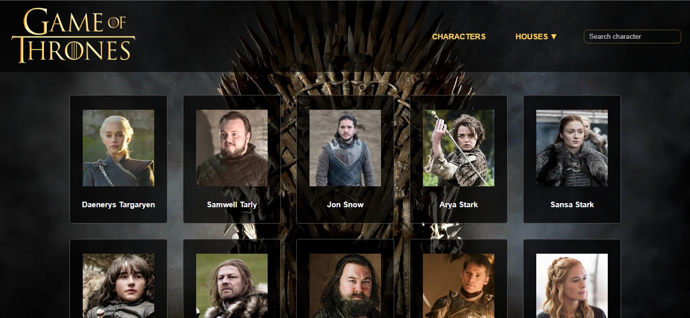

# ✦ Proyecto: **Game of Thrones: API**

Este proyecto forma parte del sexto módulo del curso Desarrollo Web Front End, dictado por AdaITW. La propuesta consiste en crear una aplicación que permita listar información sobre un tema a elección, comunicándote con una API pública.

## Website

[Click aquí para ver la página](https://gotapi-lmrz.netlify.app)

---

**Vista previa**

## Funcionalidad

- **Botón CHARACTER: Mostar todos los personajes**
- **Botón HOUSES: Filtrar por casas**
- **Buscar por nombre y/o apellido**
- **Abrir modal y obtener mas información al clickear CARDS**
- **Diseño responsivo:**
  - Smartphone
  - Tablet

## Realizado con:

- JAVASCRIPT VANILLA / ES6
- HTML5
- CSS3 / SASS
- API REST
- GIT
- Deploy en NETLIFY

## Recursos:

- API: https://thronesapi.com/api/v2/
- Logos casas: Google images.
- Fuente: Helvetica / Arial - https://fonts.google.com/
- Íconos: https://fontawesome.com/
